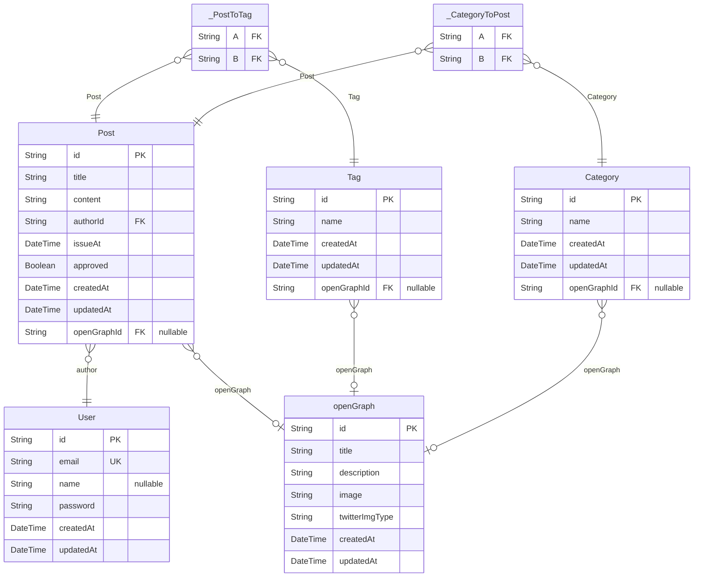

# PET System
> Generated by [`prisma-markdown`](https://github.com/samchon/prisma-markdown)

- [default](#default)

## default

### `User`

**Properties**
  - `id`: 
  - `email`: 
  - `name`: 
  - `password`: 
  - `createdAt`: 
  - `updatedAt`: 

### `Post`

**Properties**
  - `id`: 
  - `title`: 
  - `content`: 
  - `authorId`: 
  - `issueAt`: 
  - `approved`: 
  - `createdAt`: 
  - `updatedAt`: 
  - `openGraphId`: 

### `Tag`

**Properties**
  - `id`: 
  - `name`: 
  - `createdAt`: 
  - `updatedAt`: 
  - `openGraphId`: 

### `Category`

**Properties**
  - `id`: 
  - `name`: 
  - `createdAt`: 
  - `updatedAt`: 
  - `openGraphId`: 

### `openGraph`

**Properties**
  - `id`: 
  - `title`: 
  - `description`: 
  - `image`: 
  - `twitterImgType`: 
  - `createdAt`: 
  - `updatedAt`: 

### `_PostToTag`
Pair relationship table between [Post](#Post) and [Tag](#Tag)

**Properties**
  - `A`: 
  - `B`: 

### `_CategoryToPost`
Pair relationship table between [Category](#Category) and [Post](#Post)

**Properties**
  - `A`: 
  - `B`: 